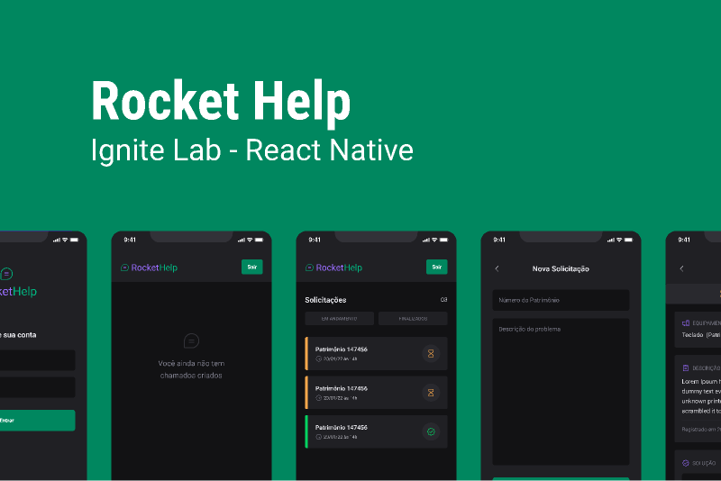

# RocketHelp

  

Projeto do Ignite Lab de React Native da Rocketseat. Que foi utilizado React Native com Expo, TypeScript e o NativeBase para criar as interfaces com produtividade. Também foi integrado o Firebase para utilizar o banco de dados Cloud Firestore para armazenar os dados da aplicação em tempo real.

  

